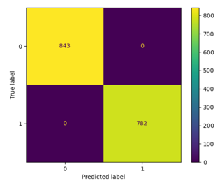
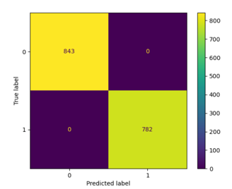

# Porównanie modeli – Random Forest vs Sieć neuronowa

## Zbiór danych
Wykorzystano **Mushroom Dataset (UCI)** – dane o grzybach (jadalne lub trujące).  
Wszystkie cechy zakodowano przy użyciu `LabelEncoder`.  
Dane podzielono na zbiór treningowy i testowy (80/20).

---

## Model 1 – Random Forest (sklearn)
- Liczba drzew: `n_estimators=100`  
- Wynik: **Accuracy = 1.00**  
- Wszystkie próbki sklasyfikowane poprawnie  
- **Macierz pomyłek:** brak błędów

---

## Model 2 – Sieć neuronowa (TensorFlow / Keras)
- Architektura: `64 → 32 → 1` (ReLU, ReLU, Sigmoid)  
- Trenowano 10 epok, optymalizator **Adam**, strata: `binary_crossentropy`  
- Wynik: **Accuracy = 1.00**  
- **Macierz pomyłek:** brak błędów

---

## Wnioski
Oba modele osiągnęły **100% dokładności**.  
Zbiór danych jest bardzo dobrze rozdzielny, a klasyfikacja jest łatwa.  
**Random Forest** jest prostszy i szybszy, natomiast **sieć neuronowa** daje ten sam wynik, ale wymaga większych zasobów obliczeniowych.

# RandomForestModelMatrix

# NeuralModelMatrix

# Model weights

