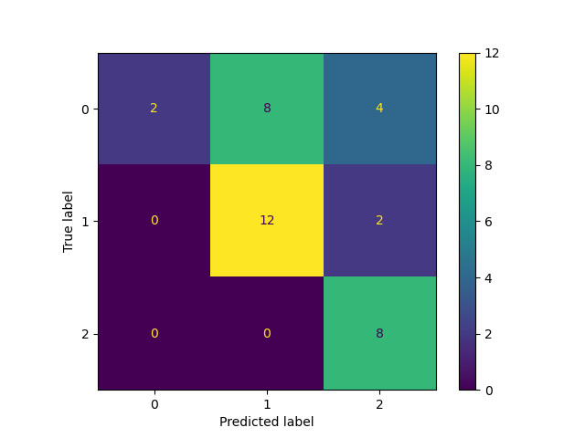
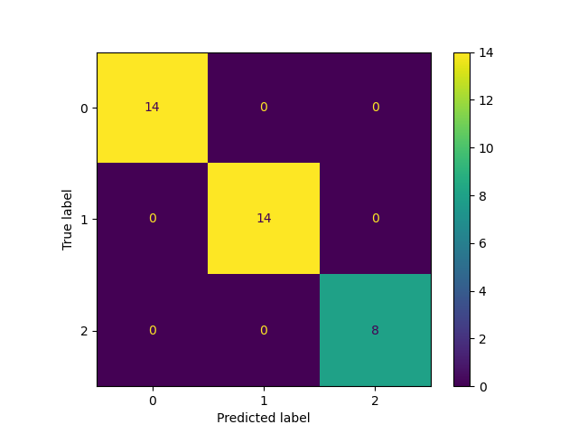

# Podsumowanie eksperymentów – Wine Dataset

## Modele i ich wagi
- **Random Forest**: 215 KB  
- **Neural Network (3 warstwy, z normalizacją)**: 99 KB  

---

## Wyniki klasyfikacji


### Random Forest

```             precision    recall  f1-score   support

           1       1.00      1.00      1.00        14
           2       1.00      1.00      1.00        14
           3       1.00      1.00      1.00         8

    accuracy                           1.00        36
   macro avg       1.00      1.00      1.00        36
weighted avg       1.00      1.00      1.00        36

```


### Bez normalizacji
- Test accuracy: 0.56  
- F1-score: 0.41–0.65  
- Klasa 2 praktycznie nie była przewidziana  
- Model trenował się niestabilnie, duże różnice między recall dla klas  

**Macierz błędów bez normalizacji:**



---

### Z warstwą normalizacji
- Test accuracy: 0.97  
- F1-score: 0.96–1.00  
- Wszystkie klasy poprawnie przewidziane w większości przypadków  
- Normalizacja poprawiła stabilność uczenia i przyspieszyła konwergencję  
- Rozmiar modelu pozostał niewielki (3 warstwy, 99 KB)  

**Macierz błędów po normalizacji:**



---

## Wnioski
- Warstwa Normalization jest kluczowa dla sieci neuronowych pracujących na danych z różnymi skalami cech  
- Nawet prosta, niewielka sieć może dorównać lub przewyższyć Random Forest w dokładności
