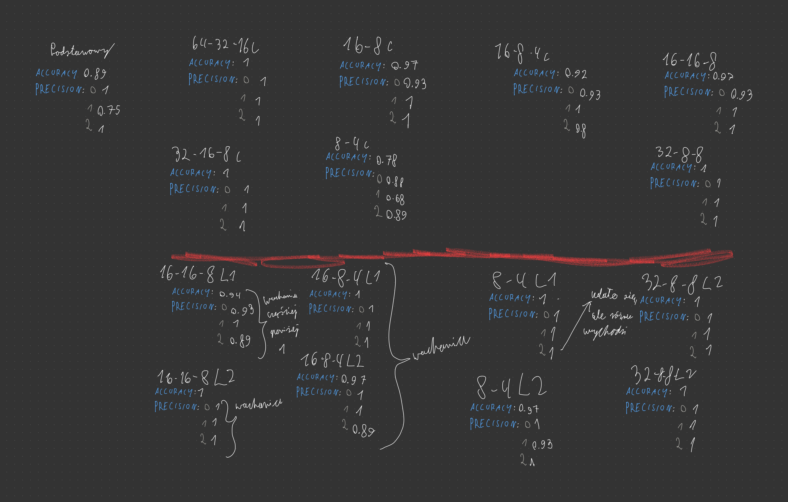

# Podsumowanie

### Podpunkt 2
model RandomForestClassifier waży `208 KB`

### Podpunkt 3
**_Model sieci neuronowej_**

| ReLU (13, 64) | ReLU (32) | ReLU (16) | SoftMax(3) |
|---------------|-----------|-----------|------------|

Accuracy: 0.89 \
Precision:
  - 1.00
  - 0.75
  - 1.00

### Podpunkt 4
Normalizacja danych spowodowała osiągnięcie 100% dokładności i precyzji

### Podpunkt 5


#### Zapisane modele

**_Nazewnictwo modeli_**

_Pierwsza część_ to rodzaj modelu\
`nn - model sieci neuronowej`\
`nn_norm - nn z normalizacją`

_Druga część_ to liczba neuronów dla każdej warstwy ukrytej, gdzie każda
warstwa używa aktywacji **ReLU**, optymalizatora **Adam** i 
inicjalizatora **GlorotUniform**. 

_Trzecia część_ to ewentualne regulatory l1 lub l2

```text
72K nn_64_32_16.keras
115K nn_64_64_32.keras
41K nn_norm_16_16_8.keras
42K nn_norm_16_16_8_l1.keras
41K nn_norm_16_16_8_l2.keras
38K nn_norm_16_8_4.keras
39K nn_norm_16_8_4_l1.keras
39K nn_norm_16_8_4_l2.keras
39K nn_norm_16_8_8.keras
33K nn_norm_16_8.keras
47K nn_norm_32_16_8.keras
43K nn_norm_32_8_8_l1.keras
43K nn_norm_32_8_8_l2.keras
75K nn_norm_64_32_16.keras
31K nn_norm_8_4.keras
31K nn_norm_8_4_l1.keras
31K nn_norm_8_4_l2.keras
```

####  Najlepszy model (najmniejszy i skuteczny)
Teoretycznie najlepszy model to `nn_norm_8_4_l1.keras`, ale przez 
jego wachania, ale przez to, że w niektórych próbach osiągał beznadziejny
wynik to wybrałbym `nn_norm_16_8_4_l1.keras`.

## Obserwacje
Model **RandomForestTree** waży niemal 2 razy więcej niż 
najcięższy zapisany model **sieci neuronowej**. Niemniej bez normalizacji
oraz regulatorów osiągał lepsze wyniki w większości przypadków, a 
na pewno stworzenie go kosztowało znacznie mniej czasu. Jeżeli jednak
w grę wchodzą wymienione narzędzia, to sieć neuronowa wychodzi o
wiele lepiej, nawet jeżeli jest małą siecią. Nie zauważyłem większych
różnic między regulatorami l1 i l2, jednak l1 wydawał się minimalnie
lepszy dla mniejszych sieci.