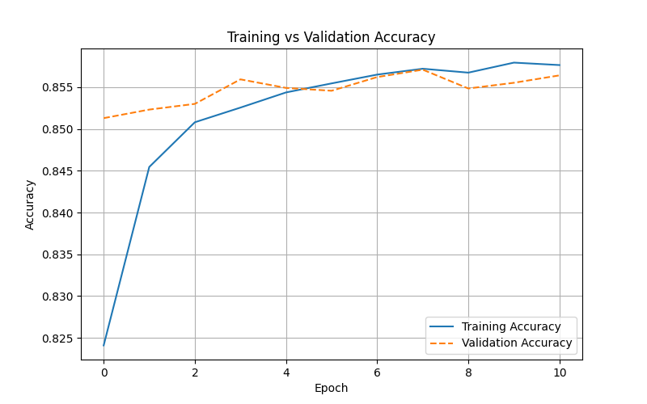
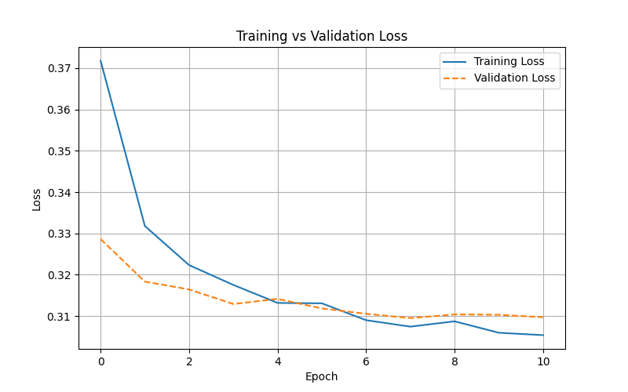

Random forest stats:
precision: 0.7484
accuracy: 0.8607

DNN:

accuracy: 0.8614 - 
loss: 0.3014 - 
precision: 0.7544 - 
recall: 0.6239 - 
val_accuracy: 0.8574 - 
val_loss: 0.3102 - 
val_precision: 0.7654 - 
val_recall: 0.5824

model głębokiego uczenia uzyskał w tym wypadku bardzo podobne wyniki co klasyfikator Random forest