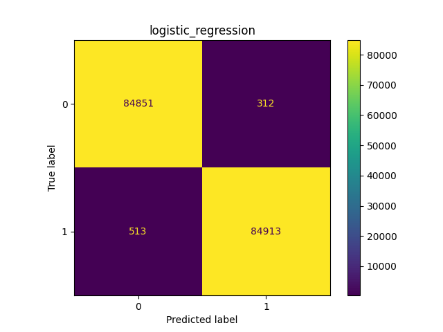
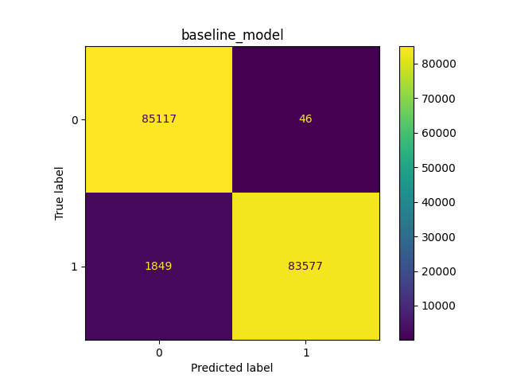

### Classification Report — logistic_regression

| Class | Precision | Recall | F1-Score | Support |
|------:|----------:|-------:|---------:|--------:|
| **0** (non-fraud) | 0.9940 | 0.9963 | 0.9952 | 85,163 |
| **1** (fraud)     | 0.9963 | 0.9940 | 0.9952 | 85,426 |

**Accuracy:** 0.9952  
**Macro Avg:** Precision 0.9952 · Recall 0.9952 · F1-Score 0.9952  
**Weighted Avg:** Precision 0.9952 · Recall 0.9952 · F1-Score 0.9952

### Classification Report — baseline_model

| Class | Precision | Recall | F1-Score | Support |
|------:|----------:|-------:|---------:|--------:|
| **0** (non-fraud) | 0.9994 | 0.9002 | 0.9472 | 85,163 |
| **1** (fraud)     | 0.9095 | 0.9995 | 0.9524 | 85,426 |

**Accuracy:** 0.9499  
**Macro Avg:** Precision 0.9545 · Recall 0.9499 · F1-Score 0.9498  
**Weighted Avg:** Precision 0.9544 · Recall 0.9499 · F1-Score 0.9498

### Classification Report — tuned_baseline_model

| Class | Precision | Recall | F1-Score | Support |
|------:|----------:|-------:|---------:|--------:|
| **0** (non-fraud) | 0.9929 | 0.9990 | 0.9960 | 85,163 |
| **1** (fraud)     | 0.9990 | 0.9929 | 0.9959 | 85,426 |

**Accuracy:** 0.9959  
**Macro Avg:** Precision 0.9960 · Recall 0.9960 · F1-Score 0.9959  
**Weighted Avg:** Precision 0.9960 · Recall 0.9959 · F1-Score 0.9959

Model: baseline\
┌─────────────────────────────────┬────────────────────────┬───────────────┐\
│ Layer (type)                    │ Output Shape           │       Param # │\
├─────────────────────────────────┼────────────────────────┼───────────────┤\
│ dense (Dense)                   │ (None, 128)            │         3,968 │\
├─────────────────────────────────┼────────────────────────┼───────────────┤\
│ dense_1 (Dense)                 │ (None, 64)             │         8,256 │\
├─────────────────────────────────┼────────────────────────┼───────────────┤\
│ dense_2 (Dense)                 │ (None, 1)              │            65 │\
└─────────────────────────────────┴────────────────────────┴───────────────┘

Model: tuned\
┌─────────────────────────────────┬────────────────────────┬───────────────┐\
│ Layer (type)                    │ Output Shape           │       Param # │\
├─────────────────────────────────┼────────────────────────┼───────────────┤\
│ dense (Dense)                   │ (None, 192)            │         5,952 │\
├─────────────────────────────────┼────────────────────────┼───────────────┤\
│ dropout (Dropout)               │ (None, 192)            │             0 │\
├─────────────────────────────────┼────────────────────────┼───────────────┤\
│ dense_1 (Dense)                 │ (None, 80)             │        15,440 │\
├─────────────────────────────────┼────────────────────────┼───────────────┤\
│ dense_2 (Dense)                 │ (None, 1)              │            81 │\
└─────────────────────────────────┴────────────────────────┴───────────────┘

wnioski: model ztuningowany poradził sobie najlepiej, auto-tuner zmodyfikował kształt dwóch\
warstw głębkokich i dodał jedną warstwę dropout. Największa możliwa ilość neuronów w warstwach wcale nie\
okazała się najlepszym rozwiązaniem.