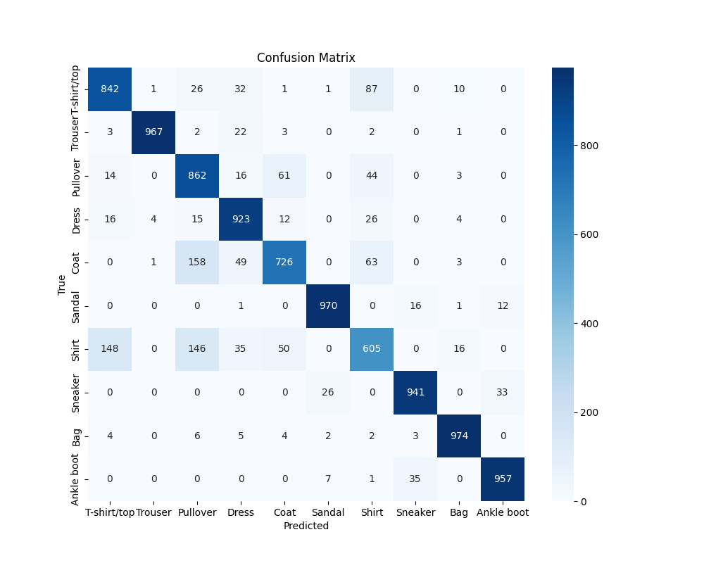
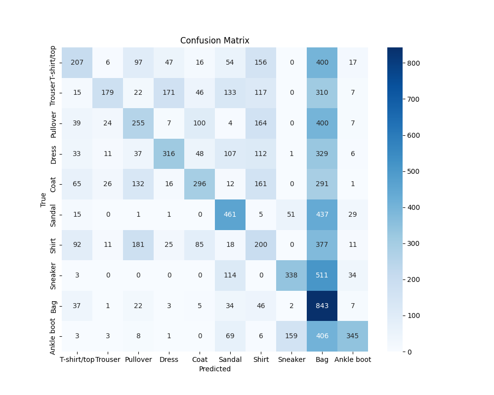
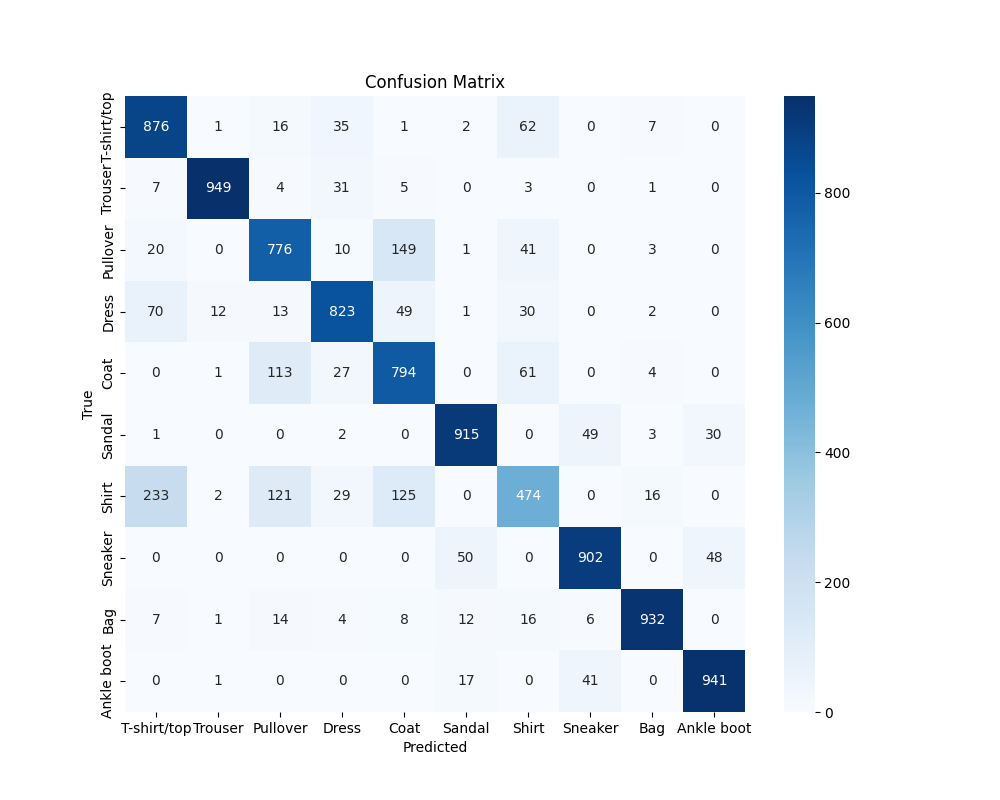
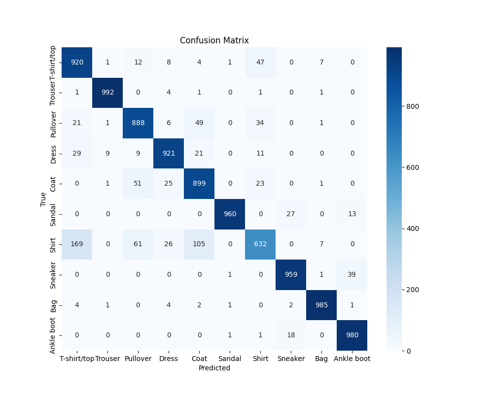
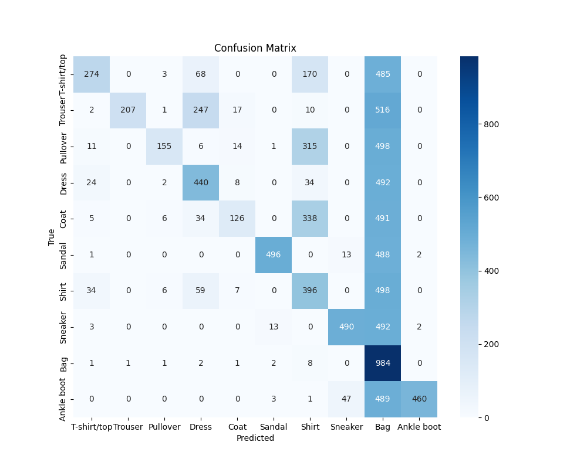
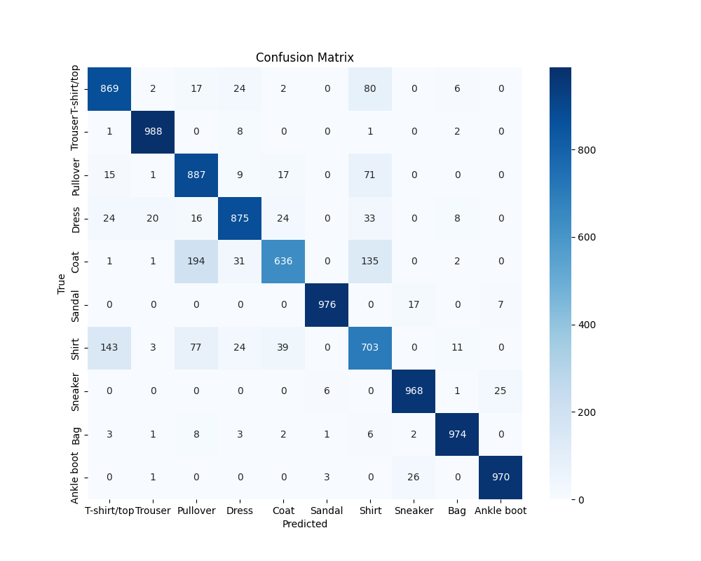

Model bazowy:

    ┏━━━━━━━━━━━━━━━━━━━━━━━━━━━━━━━━━┳━━━━━━━━━━━━━━━━━━━━━━━━┳━━━━━━━━━━━━━━━┓
    ┃ Layer (type)                    ┃ Output Shape           ┃       Param # ┃
    ┡━━━━━━━━━━━━━━━━━━━━━━━━━━━━━━━━━╇━━━━━━━━━━━━━━━━━━━━━━━━╇━━━━━━━━━━━━━━━┩
    │ flatten_1 (Flatten)             │ (None, 784)            │             0 │
    ├─────────────────────────────────┼────────────────────────┼───────────────┤
    │ dense_2 (Dense)                 │ (None, 128)            │       100,480 │
    ├─────────────────────────────────┼────────────────────────┼───────────────┤
    │ dense_3 (Dense)                 │ (None, 10)             │         1,290 │
    └─────────────────────────────────┴────────────────────────┴───────────────┘

model: bazowy\
dane treningowe: bez augmentacji\
dane testowe: bez augmentacji

Classification Report:

                precision    recall  f1-score   support

    T-shirt/top    0.82      0.84      0.83      1000
     Trouser       0.99      0.97      0.98      1000
    Pullover       0.71      0.86      0.78      1000
       Dress       0.85      0.92      0.89      1000
        Coat       0.85      0.73      0.78      1000
      Sandal       0.96      0.97      0.97      1000
       Shirt       0.73      0.60      0.66      1000
     Sneaker       0.95      0.94      0.94      1000
         Bag       0.96      0.97      0.97      1000
    Ankle boot     0.96      0.96      0.96      1000

    accuracy                           0.88     10000
    macro avg      0.88      0.88      0.88     10000
    weighted avg   0.88      0.88      0.88     10000

model: bazowy\
dane treningowe: bez augmentacji\
dane testowe: po augmentacji

Classification Report:

                precision    recall  f1-score   support

    T-shirt/top    0.41      0.21      0.27      1000
     Trouser       0.69      0.18      0.28      1000
    Pullover       0.34      0.26      0.29      1000
       Dress       0.54      0.32      0.40      1000
        Coat       0.50      0.30      0.37      1000
      Sandal       0.46      0.46      0.46      1000
       Shirt       0.21      0.20      0.20      1000
     Sneaker       0.61      0.34      0.44      1000
         Bag       0.20      0.84      0.32      1000
    Ankle boot     0.74      0.34      0.47      1000

    accuracy                           0.34     10000
    macro avg      0.47      0.34      0.35     10000
    weighted avg   0.47      0.34      0.35     10000

model: bazowy\
dane treningowe: po augmentacji\
dane testowe: po augmentacji

Classification Report:

                precision    recall  f1-score   support

    T-shirt/top    0.72      0.88      0.79      1000
     Trouser       0.98      0.95      0.96      1000
    Pullover       0.73      0.78      0.75      1000
       Dress       0.86      0.82      0.84      1000
        Coat       0.70      0.79      0.75      1000
      Sandal       0.92      0.92      0.92      1000
       Shirt       0.69      0.47      0.56      1000
     Sneaker       0.90      0.90      0.90      1000
         Bag       0.96      0.93      0.95      1000
    Ankle boot     0.92      0.94      0.93      1000

    accuracy                           0.84     10000
    macro avg      0.84      0.84      0.84     10000
    weighted avg   0.84      0.84      0.84     10000

model: bazowy\
dane treningowe: po augmentacji\
dane testowe: bez augmentacji

Classification Report:

              precision    recall  f1-score   support

    T-shirt/top       0.89      0.66      0.76      1000
     Trouser       0.93      0.97      0.95      1000
    Pullover       0.70      0.74      0.72      1000
       Dress       0.81      0.82      0.81      1000
        Coat       0.80      0.55      0.65      1000
      Sandal       0.94      0.95      0.95      1000
       Shirt       0.50      0.76      0.61      1000
     Sneaker       0.94      0.90      0.92      1000
         Bag       0.99      0.90      0.95      1000
      Ankle boot   0.92      0.96      0.94      1000   

    accuracy                           0.82     10000
    macro avg      0.84      0.82      0.82     10000
    weighted avg   0.84      0.82      0.82     10000

zastosowane augmentacje danych:\

- Obrót zdjęcia o wartość z przedziału [-36, 36] stopni
- przesuniącie obrazu o wartość z przedziału [-5%, 5%]
- negatyw obrazu (zastosowany dla 50% obrazów)

Model cnn:

    ┌─────────────────────────────────┬────────────────────────┬───────────────┐
    │ Layer (type)                    │ Output Shape           │       Param # │
    ├─────────────────────────────────┼────────────────────────┼───────────────┤
    │ conv2d (Conv2D)                 │ (None, 28, 28, 32)     │           320 │
    ├─────────────────────────────────┼────────────────────────┼───────────────┤
    │ max_pooling2d (MaxPooling2D)    │ (None, 14, 14, 32)     │             0 │
    ├─────────────────────────────────┼────────────────────────┼───────────────┤
    │ conv2d_1 (Conv2D)               │ (None, 14, 14, 64)     │        18,496 │
    ├─────────────────────────────────┼────────────────────────┼───────────────┤
    │ max_pooling2d_1 (MaxPooling2D)  │ (None, 7, 7, 64)       │             0 │
    ├─────────────────────────────────┼────────────────────────┼───────────────┤
    │ flatten (Flatten)               │ (None, 3136)           │             0 │
    ├─────────────────────────────────┼────────────────────────┼───────────────┤
    │ dense (Dense)                   │ (None, 128)            │       401,536 │
    ├─────────────────────────────────┼────────────────────────┼───────────────┤
    │ dense_1 (Dense)                 │ (None, 10)             │         1,290 │
    └─────────────────────────────────┴────────────────────────┴───────────────┘

model: cnn\
dane treningowe: bez augmentacji\
dane testowe: bez augmentacji

Classification Report:

                precision    recall  f1-score   support

    T-shirt/top    0.80      0.92      0.86      1000
     Trouser       0.99      0.99      0.99      1000
    Pullover       0.87      0.89      0.88      1000
       Dress       0.93      0.92      0.92      1000
        Coat       0.83      0.90      0.86      1000
      Sandal       1.00      0.96      0.98      1000
       Shirt       0.84      0.63      0.72      1000
     Sneaker       0.95      0.96      0.96      1000
         Bag       0.98      0.98      0.98      1000
    Ankle boot     0.95      0.98      0.96      1000

    accuracy                           0.91     10000
    macro avg      0.91      0.91      0.91     10000
    weighted avg   0.91      0.91      0.91     10000

model: cnn\
dane treningowe: bez augmentacji\
dane testowe: po augmentacji

Classification Report:

                precision    recall  f1-score   support

    T-shirt/top    0.77      0.27      0.40      1000
     Trouser       1.00      0.21      0.34      1000
    Pullover       0.89      0.15      0.26      1000
       Dress       0.51      0.44      0.47      1000
        Coat       0.73      0.13      0.21      1000
      Sandal       0.96      0.50      0.65      1000
       Shirt       0.31      0.40      0.35      1000
     Sneaker       0.89      0.49      0.63      1000
         Bag       0.18      0.98      0.31      1000
    Ankle boot     0.99      0.46      0.63      1000

    accuracy                           0.40     10000
    macro avg      0.72      0.40      0.43     10000
    weighted avg   0.72      0.40      0.43     10000

model: cnn\
dane treningowe: po augmentacji\
dane testowe: po augmentacji

Classification Report:

                precision    recall  f1-score   support

    T-shirt/top    0.84      0.85      0.84      1000
     Trouser       0.99      0.98      0.98      1000
    Pullover       0.86      0.80      0.83      1000
       Dress       0.89      0.89      0.89      1000
        Coat       0.74      0.91      0.82      1000
      Sandal       0.99      0.95      0.97      1000
       Shirt       0.75      0.61      0.67      1000
     Sneaker       0.94      0.97      0.95      1000
         Bag       0.98      0.97      0.98      1000
    Ankle boot     0.96      0.96      0.96      1000

    accuracy                           0.89     10000
     macro avg     0.89      0.89      0.89     10000
    weighted avg   0.89      0.89      0.89     10000

model: cnn\
dane treningowe: po augmentacji\
dane testowe: bez augmentacji

Classification Report:

                precision    recall  f1-score   support

     T-shirt/top   0.82      0.87      0.85      1000
     Trouser       0.97      0.99      0.98      1000
    Pullover       0.74      0.89      0.81      1000
       Dress       0.90      0.88      0.89      1000
        Coat       0.88      0.64      0.74      1000
      Sandal       0.99      0.98      0.98      1000
       Shirt       0.68      0.70      0.69      1000
     Sneaker       0.96      0.97      0.96      1000
         Bag       0.97      0.97      0.97      1000
    Ankle boot     0.97      0.97      0.97      1000

    accuracy                           0.88     10000
     macro avg     0.89      0.88      0.88     10000
    weighted avg   0.89      0.88      0.88     10000

Podsumowanie\
w modelu bazowym gdy został wyuczony na danych po augmentacji radził sobie równie dobrze z danymi testowymi z augmentacją jak i bez\
gdy był nauczony na danych bez augmentacji w przypadku testowania na danych po augmentacji metryki były praktycznie o połowę gorsze\
tak samo zachował się model z siecią konwolucyjną\
najlepiej radziły sobie oba modele na danych testowych bez augmentacji, wytrenowane również na nieprzerobionych danych, co jest spodziewanym wynikiem\
jednak wyniki były minimalnie gorsze w przypadku treningu na danych po augmentacji, a klasyfikacja danych zniekształconych bardzo skuteczna, co pokazuje że augmentacja przynosi pozytywne\
efekty ku polepszeniu zdolności generalizacji modelu\