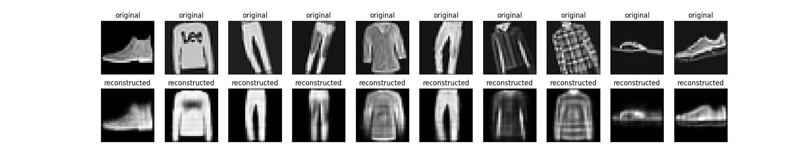

normal Autoencoder:\
 loss: 0.0134 - val_loss: 0.0135

Autoencoder with convolutions:\
loss: 0.0138 - val_loss: 0.0139

Autoencoder with convolutions and transposition:\
loss: 0.0283 - val_loss: 0.0281

Najlepszy rezultat uzyskałem używając prostego autoenkodera z przykładu Tensorflow.\
Do drugiego modelu dodałem dwie warstwy konwolucyjne w części encodera, rezultaty były minimalnie gorsze od bazowego modelu\
Jako trzeci przetestowałem bardziej zaawansowany przykład autoenkodera z dokumentacji Tensorflow\
Ma wartswy konwolucyjne w cześci enkodera i warstwy konwolucyjne z transpozycją w części dekodera.\
ta architektura sprawdziła się najgorzej otrzymując finalnie loss dwukrotnie gorszy od modelu bazowego